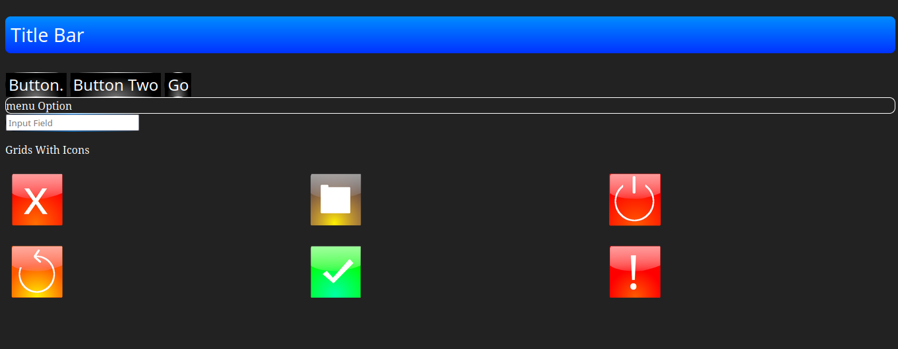

# ArgonUI
Want To Feel the Nostalgia of the Early 2000's? This is For You
ArgonUI is a CSS stylesheet wich mimics design patterns From the early 2000's You can use it to make your website/web App feel Nostalgic. It also contains a small set of icons.

